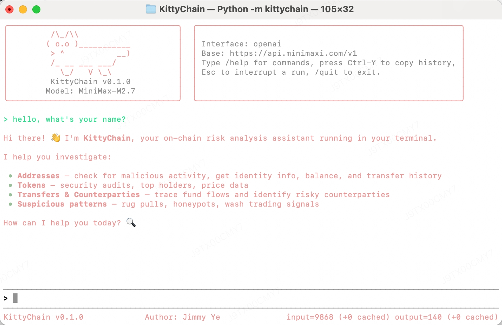

English | [中文](README_CN.md)

# KittyChain - Terminal agent for onchain analysis

KittyChain is a lightweight terminal AI agent focused on practical onchain investigation workflows. It combines a compact interactive CLI with built-in tools for wallet inspection, token analysis, web lookup, local file operations, and skill-based task guidance, so you can move from a question to an actionable chain analysis session in one place.



## Get Started

1. Install KittyChain:

```bash
pip install kittychain
```

2. Start the guided configuration flow:

```bash
kittychain --config
```

3. Launch the interactive terminal UI:

```bash
kittychain
```

## Features And Onchain Capabilities

- Lightweight terminal agent loop with an interactive REPL and one-shot prompt mode.
- Support for OpenAI-compatible and Anthropic-compatible model interfaces.
- Built-in local tools for shell execution, file reading and editing, web search, web browser fetching, TODO tracking, and skill loading.
- Slash-command driven workflow for switching models, saving sessions, compacting context, and browsing loaded skills.
- Session persistence and interruption support for longer investigative workflows.

KittyChain also includes built-in onchain analysis tools for common investigation tasks:

- Address balance lookup
- Address identity and label lookup
- Address transfer inspection
- Malicious address screening
- Token info lookup
- Token security checks

This makes KittyChain a practical fit for wallet triage, token due diligence, suspicious-address checks, and general blockchain research directly from the terminal.

## Usage

Run the interactive terminal UI:

```bash
kittychain
```

Run a one-shot prompt and exit:

```bash
kittychain -p "Check this wallet and summarize the risk signals"
```

Resume a saved session:

```bash
kittychain -r session_1234567890
```

Open the configuration wizard:

```bash
kittychain --config
```

You can also start KittyChain with the module entry point:

```bash
python -m kittychain
```

When the CLI is busy, press `Esc` to interrupt the current run at the next safe checkpoint.

## Interactive Commands

Inside the REPL, KittyChain supports:

- `/help`
- `/reset`
- `/skills`
- `/<skill name>`
- `/model <name>`
- `/tokens`
- `/compact`
- `/save`
- `/sessions`
- `/quit`

The `/skills` command shows the skills loaded at startup. Slash commands also support prefix matching while typing, making it easier to discover available commands and skills from the terminal.
